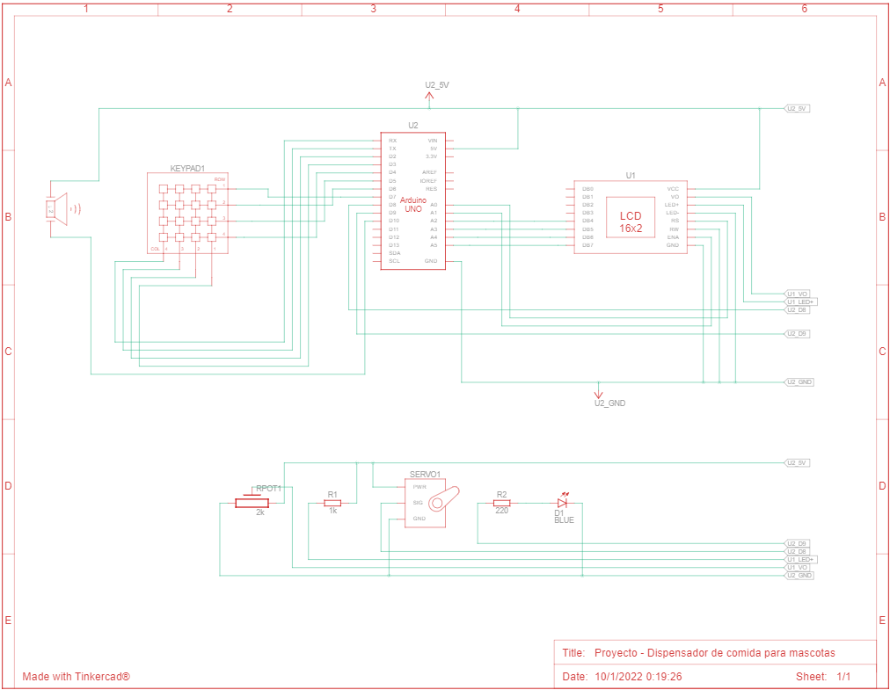

# Pet food dispenser with Arduino Uno R3
Project about pet food dispenser with Arduino Uno R3, keypad 4x4 and LCD display 16x2.

## Content
This project has two options:
* Option A: The LED turns on and off for 5 times fast, then stays on while the servomotor opens the opening to let the pet food out 3 times fast, finally the LED turns off and plays a short melody.
* Option B: Mute or unmute the piezo buzzer.

## Demo
If you want to see the demo of this proyect deployed, you can visit [Demo of the proyect](https://www.tinkercad.com/things/9iVNfFJeRKA).

## Components list
* Arduino Uno R3
* Protoboard
* LCD Display 16x2
* Keypad 4x4
* Servo-motor
* Piezo buzzer
* Led
* 2k ohms potentiometer
* 220 ohms resistor
* 1k ohms resistor

## Schematic view

## Simulation photo

